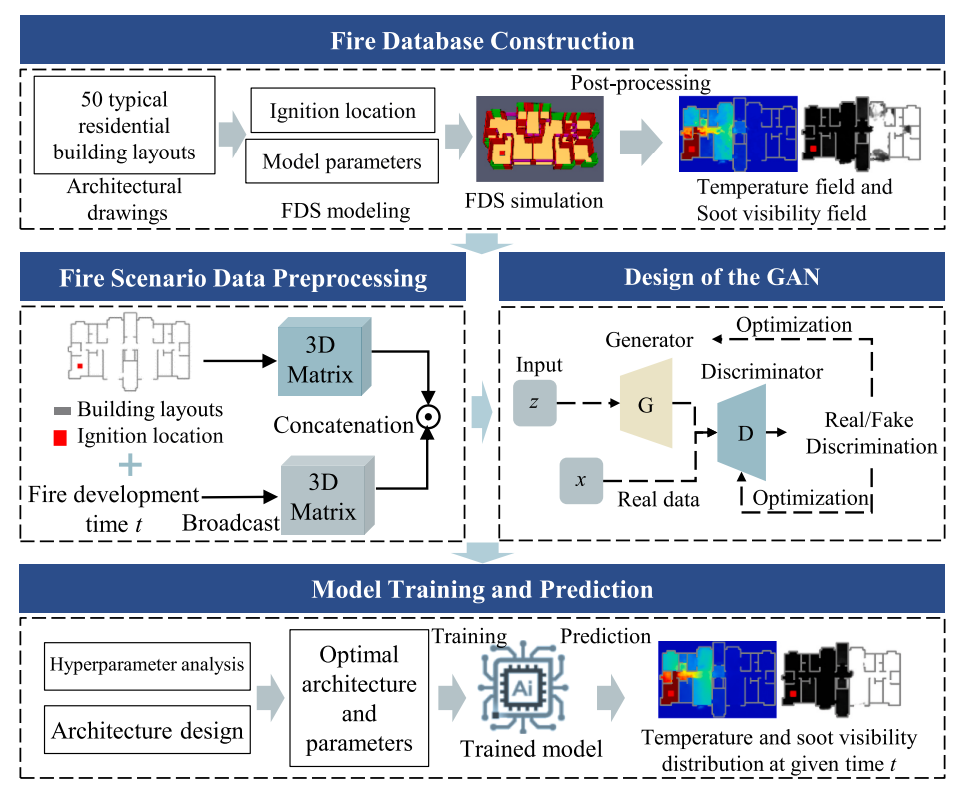

# FireSimulation
Fire scenario simulation method for residential building
## Methodology  
The framework of the proposed method is shown in the figure below.  
  

Relevant details can be found in the paper:  
Cheng, Qingle, et al. "Fire scenario simulation method for residential buildings based on generative adversarial network." *Developments in the Built Environment* (2025): 100720.
This video demonstrates the Fire Simulation Method Based on GAN, as proposed by Qingle Cheng (chengql94@163.com), currently under submission for publication, for academic and research purposes only.


## Citation  
If you use this code in your research, please cite the following paper:  

```bibtex
@article{CHENG2025100720,
  title = {Fire scenario simulation method for residential buildings based on generative adversarial network},
  journal = {Developments in the Built Environment},
  volume = {23},
  pages = {100720},
  year = {2025},
  issn = {2666-1659},
  doi = {https://doi.org/10.1016/j.dibe.2025.100720},
  url = {https://www.sciencedirect.com/science/article/pii/S2666165925001206},
  author = {Qingle Cheng and Xuyang Wang and Jin Zhuang and Wenjie Liao and Linlin Xie},
  keywords = {Building fire simulation, Generative adversarial network, Residential building, Fire dynamics, Temperature and soot visibility},
  abstract = {Fire scenario simulation in residential buildings is crucial for fire safety design, risk assessment, and emergency management. Traditional CFD-based methods face challenges, including long computation times and reliance on expertise, limiting their use for real-time prediction and rapid design optimization. This study introduces a novel simulation method using Generative Adversarial Networks (GANs). A database of 50 residential layouts encompassing a wide variety of apartment configurations is constructed, with high-resolution spatiotemporal data on temperature and soot visibility generated via CFD. The GAN-based model uses layouts, ignition locations, and fire development times as inputs to predict temperature and soot fields. Experimental results show the model achieves an average Structural Similarity Index (SSIM) of 95.7 % compared to CFD and reduces prediction time to 2.56 s—an efficiency improvement of 80,000 times. This method provides an efficient tool for fire risk assessment, evacuation planning, and intelligent fire protection system design in residential buildings.}
}

